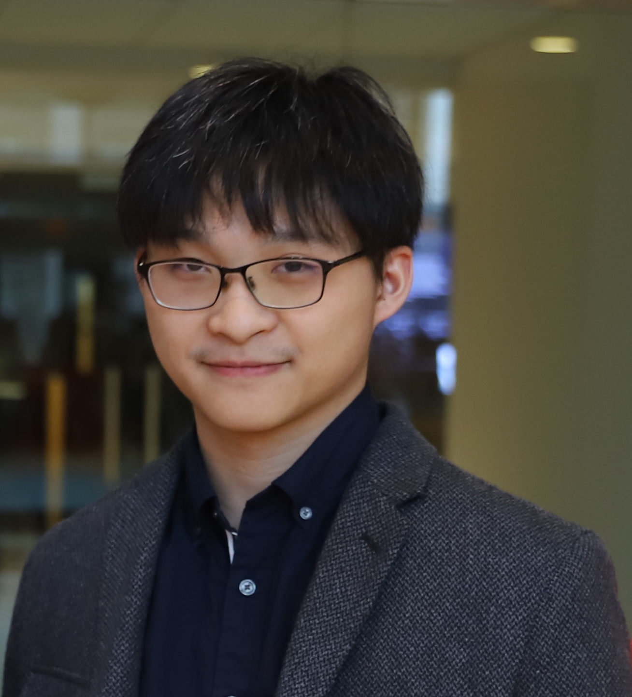

# Shao-Peng Yang

## Who am I? 😉

Hi there 👋, I am Shao-Peng Yang, a Ph.D. student in Electrical and Computer Engineering at Syracuse University, under the guidance of the awesome [Professor Bryan S. Kim](https://web.ecs.syr.edu/~bkim01/?_gl=1*1h3b5s*_ga*MTU2ODk3ODQ5Ni4xNjc0ODY5NzM3*_ga_QT13NN6N9S*MTY4NTM5MDQ3Mi41My4xLjE2ODUzOTE2MTIuNjAuMC4w). 
My areas of interests include studying memory Systems, Operating Systems, and Storage Systems. 
Right now, I am working on CXL Type 3 devices and the CXL fabric manager. 
Feel free to connect with me.

To know more about me, feel free to check out my [resume/CV](./Shao_Peng_Yang_Resume_CV.pdf)

## What are my skills? 💻

* Programming: C++, Parallel and Multithreaded Programming, C, Assembly, Python, Matlab
* Hardware Design: Verilog, Altium, Digital Logic Design, skills in utilizing lab tools such as oscilloscopes

## Education 🎓

* Ph.D.: Syracuse University, Fall 2021 Year - Spring 2026 (expected)
  * Electrical and Computer Engineering
* Bachelor of Science: Western Washington University, Fall 2017 - Spring 2021
  * Electrical and Computer Engineering
  
## Experience 👔

* Research Assistant: Syracuse University, Fall 2021 - present
  * Advisor: Dr. Bryan S. Kim
  * Exploring methods to model CXL fabric for connecting multiple hosts and devices
  * Building a CXL-flash device simulator based on an open-sourced SSD simulator in C++
  * Researching the architecture design of CXL-flash using techniques such as caching and prefetching

## Publications 📚

* Shao-Peng Yang, Minjae Kim, Sanghyun Nam, Juhyung Park, Jin-yong Choi, Eyee Hyun Nam, Eunji Lee,
Sungjin Lee, Bryan S. Kim. Overcoming the Memory Wall with CXL-enabled SSDs. To appear in USENIX
Annual Technical Conference (ATC), 2023

## Contact me? 😏
Feel free to contact me for more information by sending an email to <syang32@syr.edu>.
You can also find my past projects at my [GitHub](https://github.com/spypaul).
