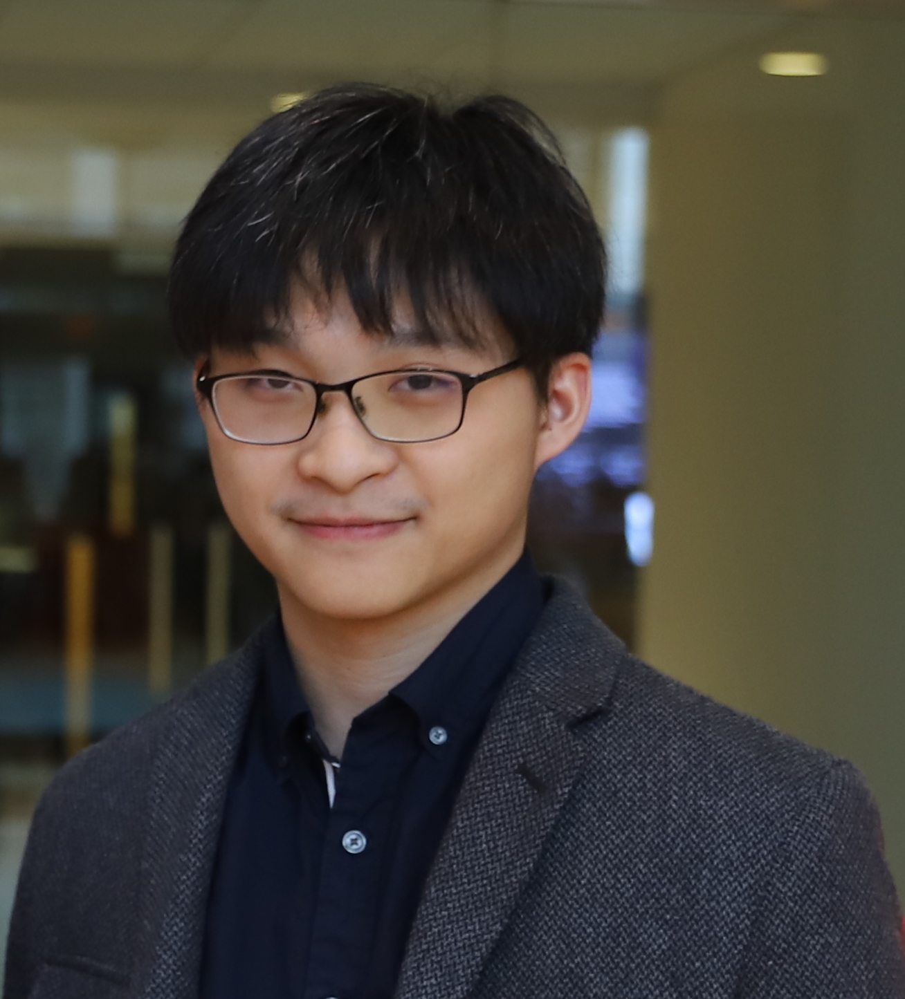

# Shao-Peng Yang

## Who am I? 😉

Hi there 👋, I am Shao-Peng Yang, a Ph.D. student in Electrical and Computer Engineering at Syracuse University, under the guidance of the awesome [Professor Bryan S. Kim](https://web.ecs.syr.edu/~bkim01/?_gl=1*1h3b5s*_ga*MTU2ODk3ODQ5Ni4xNjc0ODY5NzM3*_ga_QT13NN6N9S*MTY4NTM5MDQ3Mi41My4xLjE2ODUzOTE2MTIuNjAuMC4w). 
My areas of interests include Memory Systems, Operating Systems, and Storage Systems, with a particular focus on CXL technology. 
Right now, I am working on energy-efficient CXL memory systems and CXL-based near-data processing (NDP) with peer-to-peer device collaboration. 
Feel free to connect with me.

To know more about me, feel free to check out my [resume/CV](./Shao_Peng_Yang_Resume_CV.pdf)

## Publications 📚

* Shao-Peng Yang, Sandy Lin, Gongjin Sun, Dongyang Li, Shuyi Pei, Bryan Kim. Rethinking Near-Data Processing Execution: Enabling Device Collaboration with CXL Peer-to-Peer Communication. To appear in IEEE Cluster, 2026
* Hanqiu Chen, Shao-Peng Yang (co-first author), Mohammadreza Soltaniyeh, Shuyi Pei, Andrew Chang, Bryan S. Kim, Cong Hao. COMETS: Cost-effective Multi-node Efficient Training System with Memory Pooling and Sharing. ACM International Conference on Supercomputing (ICS), 2026
* Shao-Peng Yang, Minjae Kim, Sanghyun Nam, Juhyung Park, Jin-yong Choi, Eyee Hyun Nam, Eunji Lee, Sungjin Lee, Bryan S. Kim. Overcoming the Memory Wall with CXL-enabled SSDs. USENIX Annual Technical Conference (ATC), 2023

## What are my skills? 💻

* Programming: C++, Parallel and Multithreaded Programming, C, Assembly, Python, Matlab
* Hardware Design: Verilog, Altium, Digital Logic Design, System-on-Chip Design, skills in utilizing lab tools such as oscilloscopes
* Systems & Security: Computer Architecture, Internet Security (network layers, Scapy, Wireshark/tcpdump)

## Education 🎓

* Ph.D.: Syracuse University, Fall 2021 - Spring 2027 (expected)
  * Electrical and Computer Engineering
* Bachelor of Science: Western Washington University, Fall 2017 - Spring 2021
  * Electrical and Computer Engineering, GPA: 3.96/4.0 | IEEE-Eta Kappa Nu

## Experience 👔

* Research Assistant: Syracuse University, Fall 2021 - present
  * Advisor: Dr. Bryan S. Kim
  * Investigating energy inefficiency in CXL memory systems (Spring 2026 - present)
  * Proposed near-data processing with collaborative peers (NDP-CP), breaking the assumption that NDP devices operate independently, and evaluated it on a NUMA-based emulation platform (Spring 2025 - Spring 2026)
  * Designed a CXL-based memory pooling and sharing system to improve performance and cost efficiency for LLM training, and built a Python simulator to estimate training performance for large GPU systems with CXL integration (Spring 2024 - Spring 2025)
  * Explored design challenges of the CXL fabric manager for high system performance and balanced device loads, including memory allocation, translation, and protection (Fall 2023)
  * Investigated the design of CXL-flash, a novel memory expansion device combining CXL and flash memory, applying caching and prefetching techniques and building a trace-driven C++ simulator (Fall 2022 - Spring 2023)

* Intern, Memory Solutions Research Engineer: Samsung Semiconductor, Inc., May 2025 - August 2025
  * Supervisor: Caroline Kahn
  * Explored the benefits of CMM-H for CPU-based multi-turn LLM inference, including using CMM-H to store KV cache for long sequences and model weights
  * Identified a limitation of CMM-H as memory where data is not invalidated after use, and showcased performance overheads from high write amplification as flash memory becomes "full" with stale data

## Contact me? 😏
Feel free to contact me for more information by sending an email to <syang32@syr.edu>.
You can also find my past projects at my [GitHub](https://github.com/spypaul).
